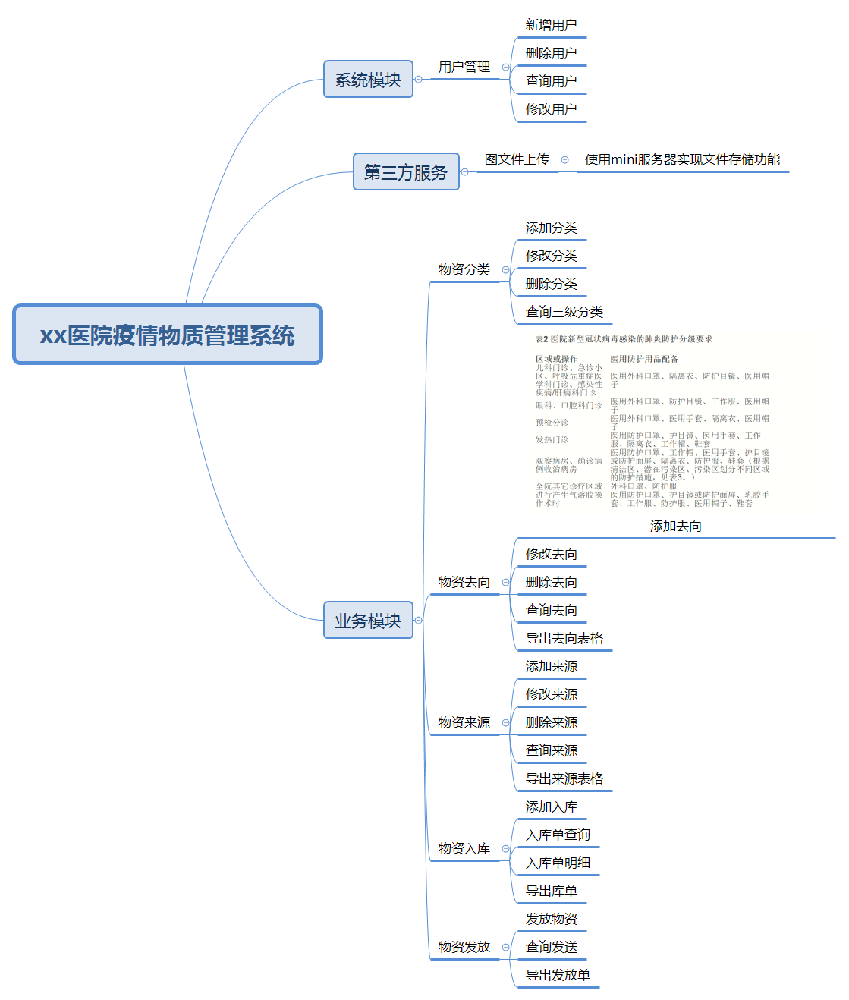

# xx医院疫情物质管理系统

## 1. 前言

​      医用物资应急管理是综合医院正常运行和实现疫情防控目标的基础保证。近年来，无论是像2003年的非典疫情这样持续时间长、影响范围广、危害力度大的事件，还是像2008年汶川地震那样突然发生且需外部支援和统一配给的事件，都导致卫生服务需求在短时间内激增，受灾地区卫生系统的应对能力严重失衡。

​     因此，建立健全突发公共卫生事件及重大传染病疫情期间应急物资管理体系是保证生命安全和维护社会稳定的重要基础。

​     本研究以湖南省某三级公立医院新冠肺炎疫情期间医用应急物资管理为研究对象，从物资的组织、筹措、配发、使用等过程管理视角出发，探索既符合合法、安全、有效的基本要求，又遵循系统性、科学性、可行性、整体性原则的医疗应急物资管理模式和对策，为保证疫情期间物资有序高效供给，提升卫生系统的突发应急管理综合能力提供借鉴和参考。

## 2. 数据库设计

### 2.1 数据库概念设计

本系统采用Oracle作为数据库开发工具。根据系统需求分析和保证数据统一、完整和高效的原则，需要对数据库进行合理的设计。

### 2.2 数据库逻辑设计

| 表名                | 说明           |
| ------------------- | -------------- |
| tb_consumer         | 使用方表       |
| tb_in_stock         | 入库单表       |
| tb_in_stock_info    | 入库单详情表   |
| tb_out_stock        | 库存单表       |
| tb_out_stock_info   | 库存单详情表   |
| tb_product          | 商品基本信息表 |
| tb_product_category | 商品类别表     |
| tb_product_stock    | 商品库存表     |
| tb_supplier         | 供应商表       |
| tb_user             | 用户表         |

**表名：**tb_consume

**数据列：**

| 序号 | 名称          | 数据类型 | 长度 | 小数位 | 允许空值 | 主键 | 默认值 | 说明               |
| ---- | ------------- | -------- | ---- | ------ | -------- | ---- | ------ | ------------------ |
| 1    | id            | int      | 10   | 0      | N        | Y    |        |                    |
| 2    | name          | varchar2 | 20   | 0      | Y        | N    |        | 物资消费方区域名称 |
| 3    | create_time   | date     | 19   | 0      | Y        | N    |        | 创建时间           |
| 4    | modified_time | date     | 19   | 0      | Y        | N    |        | 修改数据           |
| 5    | phone         | varchar2 | 20   | 0      | Y        | N    |        | 联系电话           |
| 6    | sort          | int      | 10   | 0      | Y        | N    |        | 排序               |
| 7    | contact       | varchar2 | 10   | 0      | Y        | N    |        | 联系人姓名         |

**表名：** tb_in_stock

**数据列：**

| 序号 | 名称           | 数据类型 | 长度 | 小数位 | 允许空值 | 主键 | 默认值 | 说明                                       |
| ---- | -------------- | -------- | ---- | ------ | -------- | ---- | ------ | ------------------------------------------ |
| 1    | id             | int      | 10   | 0      | N        | Y    |        |                                            |
| 2    | in_num         | varchar2 | 36   | 0      | Y        | N    |        | 入库单编号                                 |
| 3    | type           | int      | 10   | 0      | Y        | N    |        | 类型：1：捐赠，2：下拨，3：采购,4:退货入库 |
| 4    | operator       | varchar2 | 20   | 0      | Y        | N    |        | 操作人员                                   |
| 5    | create_time    | date     | 19   | 0      | Y        | N    |        | 入库单创建时间                             |
| 6    | modified       | datet    | 19   | 0      | Y        | N    |        | 入库单修改时间                             |
| 7    | product_number | int      | 10   | 0      | Y        | N    |        | 物资总数                                   |
| 8    | supplier_id    | int      | 10   | 0      | Y        | N    |        | 来源                                       |
| 9    | remark         | varchar2 | 100  | 0      | Y        | N    |        | 描述信息                                   |
| 10   | status         | int      | 10   | 0      | Y        | N    | 2      | 0:正常入库单,1:已进入回收,2:等待审核       |

**表名：**tb_in_stock_info 

**数据列：**

| 序号 | 名称           | 数据类型 | 长度 | 小数位 | 允许空值 | 主键 | 默认值 | 说明       |
| ---- | -------------- | -------- | ---- | ------ | -------- | ---- | ------ | ---------- |
| 1    | id             | int      | 10   | 0      | N        | Y    |        |            |
| 2    | in_num         | varchar2 | 36   | 0      | Y        | N    |        | 入库单编号 |
| 3    | p_num          | varchar2 | 36   | 0      | Y        | N    |        | 商品编号   |
| 4    | product_number | int      | 10   | 0      | Y        | N    |        | 数量       |
| 5    | create_time    | datet    | 19   | 0      | Y        | N    |        | 创建时间   |
| 6    | modified_time  | date     | 19   | 0      | Y        | N    |        | 修改时间   |

**表名：** tb_out_stock

**数据列：**

| 序号 | 名称           | 数据类型 | 长度 | 小数位 | 允许空值 | 主键 | 默认值 | 说明                                    |
| ---- | -------------- | -------- | ---- | ------ | -------- | ---- | ------ | --------------------------------------- |
| 1    | id             | int      | 10   | 0      | N        | Y    |        |                                         |
| 2    | out_num        | varchar2 | 36   | 0      | N        | N    |        | 出库单                                  |
| 3    | type           | int      | 10   | 0      | N        | N    |        | 出库类型:0:直接出库,1:审核出库          |
| 4    | operator       | varchar2 | 20   | 0      | Y        | N    |        | 操作人                                  |
| 5    | create_time    | date     | 19   | 0      | Y        | N    |        | 出库时间                                |
| 6    | product_number | int      | 10   | 0      | Y        | N    |        | 出库总数                                |
| 7    | consumer_id    | int      | 10   | 0      | N        | N    |        | 消费者id                                |
| 8    | remark         | varchar2 | 50   | 0      | Y        | N    |        | 备注                                    |
| 9    | status         | int      | 10   | 0      | Y        | N    |        | 状态:0:正常入库,1:已进入回收,2:等待审核 |
| 10   | priority       | int      | 10   | 0      | N        | N    |        | 紧急程度:1:不急,2:常规,3:紧急4:特急     |

**表名：** tb_out_stock_info

**数据列：**

| 序号 | 名称           | 数据类型 | 长度 | 小数位 | 允许空值 | 主键 | 默认值 | 说明     |
| ---- | -------------- | -------- | ---- | ------ | -------- | ---- | ------ | -------- |
| 1    | id             | int      | 10   | 0      | N        | Y    |        |          |
| 2    | out_num        | varchar2 | 36   | 0      | Y        | N    |        | 出库单号 |
| 3    | p_num          | varchar2 | 36   | 0      | Y        | N    |        | 商品编号 |
| 4    | product_number | int      | 10   | 0      | Y        | N    |        | 商品数目 |
| 5    | create_time    | date     | 19   | 0      | Y        | N    |        | 创建时间 |
| 6    | modified_time  | date     | 19   | 0      | Y        | N    |        | 修改时间 |

**表名：** tb_product

**数据列：**

| 序号 | 名称              | 数据类型 | 长度  | 小数位 | 允许空值 | 主键 | 默认值 | 说明                                       |
| ---- | ----------------- | -------- | ----- | ------ | -------- | ---- | ------ | ------------------------------------------ |
| 1    | id                | int      | 10    | 0      | N        | N    |        |                                            |
| 2    | p_num             | varchar2 | 255   | 0      | Y        | N    |        | 商品编号                                   |
| 3    | name              | varchar2 | 255   | 0      | Y        | N    |        | 商品名称                                   |
| 4    | image_url         | text     | 65535 | 0      | Y        | N    |        | 图片                                       |
| 5    | model             | varchar2 | 100   | 0      | Y        | N    |        | 规格型号                                   |
| 6    | unit              | varchar2 | 10    | 0      | Y        | N    |        | 计算单位                                   |
| 7    | remark            | varchar2 | 100   | 0      | Y        | N    |        | 备注                                       |
| 8    | sort              | int      | 10    | 0      | Y        | N    |        | 排序                                       |
| 9    | create_time       | date     | 19    | 0      | Y        | N    |        | 创建时间                                   |
| 10   | modified_time     | date     | 19    | 0      | Y        | N    |        | 修改时间                                   |
| 11   | one_category_id   | int      | 10    | 0      | Y        | N    |        | 1级分类                                    |
| 12   | two_category_id   | int      | 10    | 0      | Y        | N    |        | 2级分类                                    |
| 13   | three_category_id | int      | 10    | 0      | Y        | N    |        | 3级分类                                    |
| 14   | status            | int      | 10    | 0      | Y        | N    | 0      | 是否删除:1物资正常,0:物资回收,2:物资审核中 |

**表名：**tb_product_category

**数据列：**

| 序号 | 名称          | 数据类型 | 长度 | 小数位 | 允许空值 | 主键 | 默认值 | 说明       |
| ---- | ------------- | -------- | ---- | ------ | -------- | ---- | ------ | ---------- |
| 1    | id            | int      | 10   | 0      | N        | Y    |        | 类别id     |
| 2    | name          | varchar2 | 100  | 0      | Y        | N    |        | 类别名称   |
| 3    | remark        | varchar2 | 200  | 0      | Y        | N    |        | 备注       |
| 4    | sort          | int      | 10   | 0      | Y        | N    |        | 排序       |
| 5    | create_time   | date     | 19   | 0      | Y        | N    |        | 创建时间   |
| 6    | modified_time | date     | 19   | 0      | Y        | N    |        | 修改时间   |
| 7    | pid           | int      | 10   | 0      | Y        | N    |        | 父级分类id |

**表名：** tb_product_stock

**数据列：**

| 序号 | 名称  | 数据类型 | 长度 | 小数位 | 允许空值 | 主键 | 默认值 | 说明         |
| ---- | ----- | -------- | ---- | ------ | -------- | ---- | ------ | ------------ |
| 1    | id    | int      | 10   | 0      | N        | Y    |        |              |
| 2    | p_num | varchar2 | 32   | 0      | N        | N    |        | 商品编号     |
| 3    | stock | int      | 10   | 0      | Y        | N    |        | 商品库存结余 |

**表名：** tb_supplier

**数据列：**

| 序号 | 名称          | 数据类型 | 长度 | 小数位 | 允许空值 | 主键 | 默认值 | 说明       |
| ---- | ------------- | -------- | ---- | ------ | -------- | ---- | ------ | ---------- |
| 1    | id            | int      | 10   | 0      | N        | Y    |        |            |
| 2    | name          | varchar2 | 255  | 0      | Y        | N    |        | 供应商名称 |
| 3    | address       | varchar2 | 255  | 0      | Y        | N    |        | 供应商地址 |
| 4    | email         | varchar2 | 255  | 0      | Y        | N    |        | 供应商邮箱 |
| 5    | phone         | varchar2 | 255  | 0      | Y        | N    |        | 供应商电话 |
| 6    | create_time   | date     | 19   | 0      | Y        | N    |        | 创建时间   |
| 7    | modified_time | date     | 19   | 0      | Y        | N    |        | 修改时间   |
| 8    | sort          | int      | 10   | 0      | Y        | N    |        | 排序       |
| 9    | contact       | varchar2 | 20   | 0      | Y        | N    |        | 联系人     |

**表名：**tb_user

**数据列：**

| 序号 | 名称          | 数据类型 | 长度  | 小数位 | 允许空值 | 主键 | 默认值 | 说明            |
| ---- | ------------- | -------- | ----- | ------ | -------- | ---- | ------ | --------------- |
| 1    | id            | int      | 10    | 0      | N        | Y    |        | 用户ID          |
| 2    | username      | varchar2 | 50    | 0      | N        | N    |        | 用户名          |
| 3    | nickname      | varchar2 | 20    | 0      | Y        | N    |        | 昵称            |
| 4    | email         | varchar2 | 128   | 0      | Y        | N    |        | 邮箱            |
| 5    | avatar        | text     | 65535 | 0      | Y        | N    |        | 头像            |
| 6    | phone_number  | varchar2 | 20    | 0      | Y        | N    |        | 联系电话        |
| 7    | status        | int      | 10    | 0      | N        | N    |        | 状态0锁定1有效  |
| 8    | create_time   | date     | 19    | 0      | N        | N    |        | 创建时间        |
| 9    | modified_time | date     | 19    | 0      | Y        | N    |        | 修改时间        |
| 10   | sex           | int      | 10    | 0      | Y        | N    |        | 性别0男1女2保密 |
| 11   | salt          | varchar2 | 255   | 0      | Y        | N    |        | 盐              |
| 12   | password      | varchar2 | 128   | 0      | N        | N    |        | 密码            |

## 3. 系统框架

本系统主要分为三个模块，分别为系统模块、第三方服务模块、业务模块。其中系统模块负责使用本系统的用户管理；第三服务模块负责本系统中文件的存储和下载功能；业务模块负责物资分类、物资去向、物资来源、物资入库、物资发放功能的管理。该系统结构图如下图所示。

​                                                                                         

## 4. 系统运行环境

   本系统主要使用了Spring Boot框架 +Vue框架开发完成。数据库使用的是Oralce数据库

具体如下：

1. 系统开发平台：IntelliJ IDEA 2019.1 x64 WebStorm 2019.3.3 x64
2. 系统开发语言：Java、JavaScript 
3. 运行平台：Windows10
4. 数据库平台：Oralce19C

